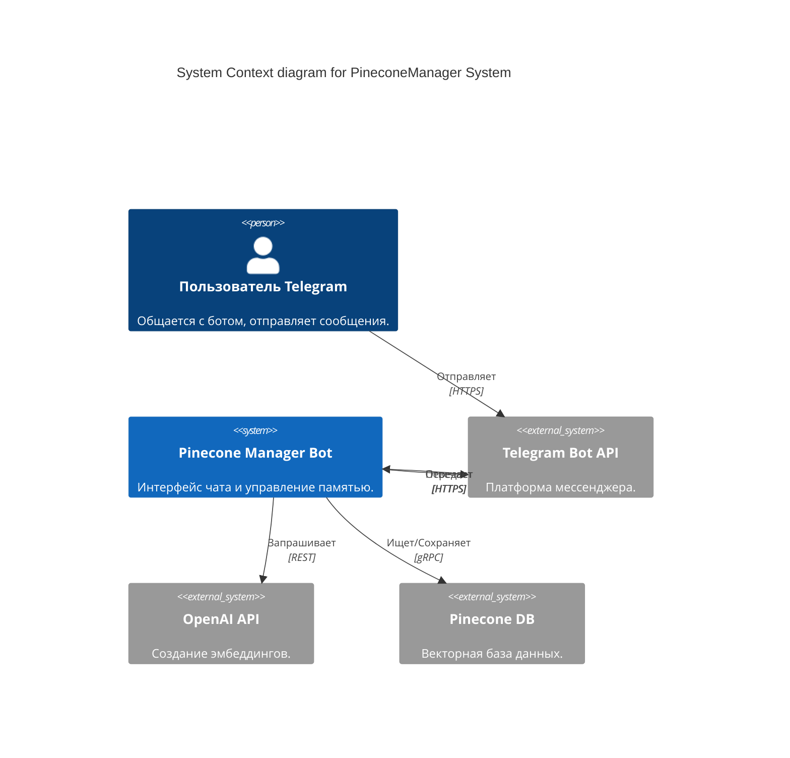
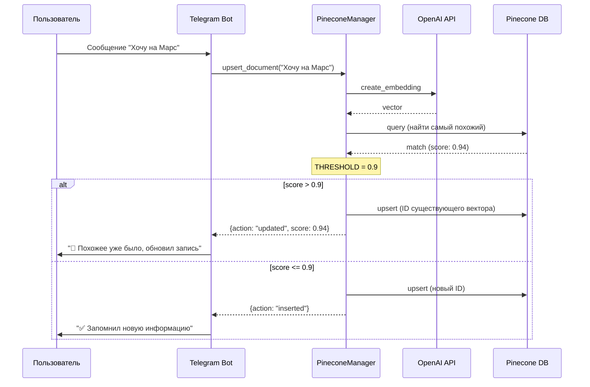

# Pinecone Manager with Cosine Similarity

Система управления долговременной памятью на базе Pinecone и OpenAI для Telegram-ботов. 
Основная особенность — автоматическая проверка входящих сообщений на дубликаты с использованием косинусного сходства (Cosine Similarity).

## 🚀 Основные возможности

- **Интеллектуальный Upsert**: Перед сохранением система проверяет, нет ли уже похожей информации в базе. Если сходство выше порога, запись обновляется, а не дублируется.
- **Чистые метаданные**: В векторном хранилище сохраняется только оригинальный текст сообщения пользователя без лишнего служебного шума (ID, таймстампы и т.д.).
- **Поддержка ProxyAPI**: Возможность указать `OPENAI_BASE_URL` для работы через прокси-серверы.
- **OpenAI Embeddings**: Использование современной модели `text-embedding-3-small`.
- **Telegram Интеграция**: Готовый бот-ассистент с обработкой исключений (например, отсутствие username у пользователя).
- **Логирование и Тестирование**: Встроенный блок для ручной проверки работы ядра системы.

## ⚙️ Настройка (Environment Variables)

Создайте файл `.env` в корне проекта:

```env
# Pinecone
PINECONE_API_KEY=ваш_ключ
PINECONE_INDEX_NAME=имя_индекса
PINECONE_ENVIRONMENT=us-east-1

# OpenAI / ProxyAPI
OPENAI_API_KEY=ваш_ключ
OPENAI_BASE_URL=https://api.proxyapi.ru/openai/v1  # Опционально
EMBEDDING_MODEL=text-embedding-3-small

# Telegram
TELEGRAM_BOT_TOKEN=токен_от_BotFather
```

## 🛠 Архитектура

### C4 System Context Diagram

<div align="center">
<div style="background-color: white; padding: 20px; border-radius: 10px;">



</div>
</div>

### UML Sequence Diagram: Логика "Умной памяти"

<div align="center">
<div style="background-color: white; padding: 20px; border-radius: 10px;">



</div>
</div>

## 📦 Установка и Запуск

1. **Установите зависимости**:
   ```bash
   pip install -r requirements.txt
   ```

2. **Проверьте ядро (PineconeManager)**:
   ```bash
   python pinecone_manager.py
   ```
   *Запустится встроенный тест: проверка связи, запись документа и проверка дубликата.*

3. **Запустите бота**:
   ```bash
   python bot.py
   ```

## 📂 Структура проекта

- [pinecone_manager.py](file:///c:/GitHub/PineconeManagerCosSim/pinecone_manager.py): Класс `PineconeManager` с логикой косинусного сходства и поддержкой OpenAI.
- [bot.py](file:///c:/GitHub/PineconeManagerCosSim/bot.py): Реализация Telegram-бота на `pyTelegramBotAPI`.
- [requirements.txt](file:///c:/GitHub/PineconeManagerCosSim/requirements.txt): Зависимости проекта.
- [.env](file:///c:/GitHub/PineconeManagerCosSim/.env): Конфигурация (необходимо создать).

## 🖼 Скриншоты работы

### Интерфейс Telegram-бота
| Похожее сообщение | Обновление записи | Статистика |
|:---:|:---:|:---:|
|  |  |  |

### Работа в терминале (Логирование)


### Панель управления Pinecone

